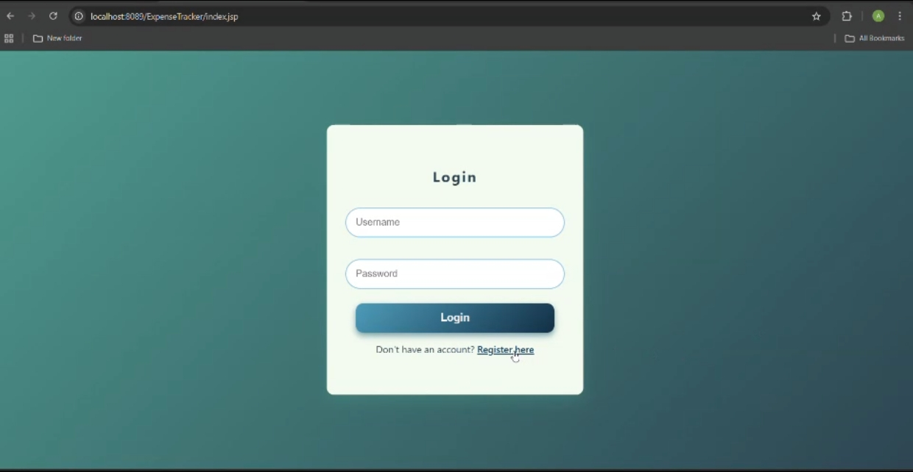
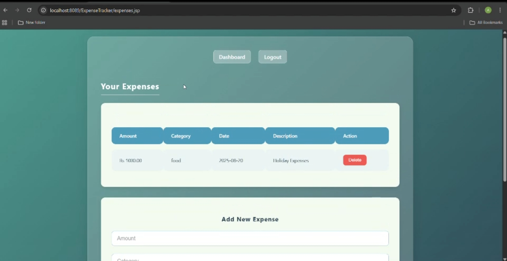

# Expense Tracker (Java + MySQL)

A simple **Expense Tracker** application built with **Java, JDBC, and MySQL**.  
It allows users to register, log in, and manage their expenses.

---

## Screenshots



##  Features
- User registration with unique username & email
- Login authentication
- Delete user functionality
- JDBC DAO layer for database operations
- Externalized config (no passwords in GitHub)

---

##  Setup Instructions

### 1. Clone the Repository
```bash
git clone https://github.com/your-username/expense-tracker.git
cd expense-tracker

```

### 2. Database Setup
 CREATE DATABASE expense_tracker;

CREATE TABLE users (
    id INT AUTO_INCREMENT PRIMARY KEY,
    username VARCHAR(50) NOT NULL UNIQUE,
    password VARCHAR(255) NOT NULL,
    email VARCHAR(100) NOT NULL UNIQUE
);
### 3. Configure Database Connection

Copy the example config file: 
cp src/main/resources/config.properties.example src/main/resources/config.properties

Update config.properties with your own MySQL credentials:
db.url=jdbc:mysql://localhost:3306/expense_tracker
db.username=root
db.password=your_password_here

### Note:
config.properties is ignored in Git.

Only config.properties.example is included for reference.

###  Running the Project

Import into Eclipse IDE as a Java project.

Ensure MySQL server is running.

Run the application.

### 📂 Project Structure
expense-tracker/
├── src/main/java/com/bean/      # UserBean and model classes
├── src/main/java/com/dao/       # UserDao and database access classes
├── src/main/resources/          # config.properties (local) + config.properties.example
├── README.md
